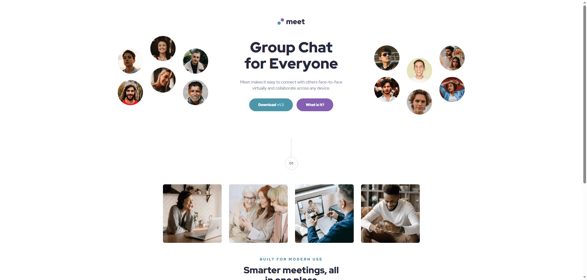

# Frontend Mentor - Meet landing page solution

This is a solution to the [Meet landing page challenge on Frontend Mentor](https://www.frontendmentor.io/challenges/meet-landing-page-rbTDS6OUR).

## Table of contents

- [Overview](#overview)
  - [The challenge](#the-challenge)
  - [Screenshot](#screenshot)
  - [Links](#links)
- [My process](#my-process)
  - [Built with](#built-with)
  - [What I learned](#what-i-learned)
  - [Continued development](#continued-development)

## Overview

### The challenge

Users should be able to:

- View the optimal layout depending on their device's screen size
- See hover states for interactive elements

### Screenshot



### Links

- [Solution URL](https://www.frontendmentor.io/solutions/plane-descending-onto-the-responsive-landing-page-no-code-delays-J-woCq_4YI)
- [Live Site](https://networksentinel.github.io/Frontend-Mentor-Challenge---Meet-landing-page/)

## My process

### Built with

- Semantic HTML5 markup
- Sass/SCSS modular, variables, mixins
- Flexbox
- CSS Grid
- Mobile-first workflow
- [Vite](https://vite.dev/) - Build tool

### What I learned

One thing I ran into during this challenge was something called bleeding, where parts of an element (like an image) go past the edges of their container. This happened in both the hero section and the footer.

To do it, I learned that using negative margins is a handy trick. It let me shift the images slightly outside their container without having to mess with the position property.

Here’s an example of how I used it to nudge the images just beyond the border:
```scss
&__img {
  &--left {
    display: none;
    
    @media (min-width: $breakpoint-desktop) {
        display: block;
        margin-top: -1.5972vw;
        margin-left: -1.6972vw;
    }
  }
  &--right{
    display: none;

    @media (min-width: $breakpoint-desktop) {
        display: block;
        margin-bottom: -1.5972vw;
        margin-right: -1.6972vw;
    }
  }  
}
```

### Continued development

This challenge was definitely more complex, and I found myself tweaking things a lot to match the Figma design as closely as possible. It made me realize how important it is to pay close attention to the small details from the start.

Moving forward, I want to get better at setting up the structure of the project properly right from the top of the DOM. That way, I’ll hopefully run into fewer layout issues and less tweaking later on.